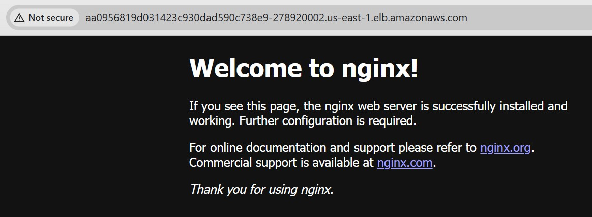

# Kubernetes Hello World Application Deployment

## Overview

This repository contains everything needed to deploy a simple "Hello World" web application to a Kubernetes cluster in AWS. The application uses **Nginx** as a web server to serve a welcome page, demonstrating modern DevOps practices including Infrastructure as Code (IaC) and automated deployments.

## What This Project Does

- **Creates AWS Infrastructure**: Automatically sets up an Amazon EKS (Elastic Kubernetes Service) cluster with proper networking
- **Deploys Web Application**: Installs an Nginx web server that serves a "Hello World" welcome page
- **Automates Everything**: Uses GitHub Actions to automatically build and deploy infrastructure and applications
- **Manages Configuration**: Uses Helm charts for easy application configuration and management

## Prerequisites

Before you can deploy this application, you'll need:

1. **AWS Account** - You'll need access to Amazon Web Services
2. **GitHub Repository** - Fork or clone this repository to your GitHub account
3. **AWS Credentials** - Access keys to allow the automation to create resources in your AWS account

## Quick Start Guide

### Step 1: Setup AWS Credentials

1. Log into your AWS Console
2. Go to IAM (Identity and Access Management)
3. Create a new user with programmatic access
4. Attach the `AdministratorAccess` policy (for simplicity)
5. Save the **Access Key ID** and **Secret Access Key**

### Step 2: Configure GitHub Secrets

1. Go to your GitHub repository
2. Click on **Settings** → **Secrets and variables** → **Actions**
3. Add these repository secrets:
   - `AWS_ACCESS_KEY_ID`: Your AWS Access Key ID
   - `AWS_SECRET_ACCESS_KEY`: Your AWS Secret Access Key

### Step 3: Deploy the Application

1. Go to your GitHub repository
2. Click on the **Actions** tab
3. Find the "Deploy EKS Environment" workflow
4. Click **Run workflow** → **Run workflow**
5. Wait for the deployment to complete (typically 10-15 minutes)

### Step 4: Access Your Application

Once the workflow completes successfully:
1. Check the workflow logs for the application URL
2. Look for a message like: `✅ Smoke-test passed! Application is live at http://your-loadbalancer-url`
3. Open that URL in your browser to see your Hello World application. Just Like below
   
   </br>

## What Gets Created

### AWS Infrastructure
- **EKS Cluster**: A managed Kubernetes cluster in AWS
- **VPC**: Virtual Private Cloud with public and private subnets
- **Load Balancer**: Automatically created to expose your application to the internet
- **EC2 Instances**: Worker nodes where your application runs

### Application Components
- **Nginx Web Server**: Serves the Hello World content
- **Kubernetes Service**: Exposes the application via a Load Balancer
- **Kubernetes Deployment**: Manages the application pods with high availability

## Project Structure

```
├── .github/workflows/
│   └── deploy.yml           # GitHub Actions CI/CD pipeline
├── helm-chart/              # Helm chart for the application
│   ├── Chart.yaml          # Chart metadata
│   ├── values.yaml         # Configuration values
│   └── templates/          # Kubernetes resource templates
│       ├── deployment.yaml # Application deployment
│       └── service.yaml    # Load balancer service
├── terraform/              # Infrastructure as Code
│   ├── main.tf            # Main infrastructure definition
│   ├── variables.tf       # Input variables
│   └── outputs.tf         # Output values
└── README.md              # This file
```

## Troubleshooting

### Common Issues

**Workflow Fails with AWS Permissions Error**
- Verify your AWS credentials are correctly set in GitHub Secrets
- Ensure your AWS user has sufficient permissions

**Application Not Accessible**
- Wait a few minutes for the Load Balancer to become ready
- Check the workflow logs for the correct URL
- Verify the Load Balancer was created in AWS Console

## Technical Details

### Architecture

This deployment creates a production-ready architecture:
- **High Availability**: Application runs across multiple availability zones
- **Scalability**: Can easily scale up/down based on demand
- **Security**: Private subnets for worker nodes, public subnets for load balancers
- **Monitoring**: Built-in AWS CloudWatch integration

### Technologies Used

- **AWS EKS**: Managed Kubernetes service
- **Terraform**: Infrastructure as Code for reproducible deployments
- **Helm**: Kubernetes package manager for application deployment
- **GitHub Actions**: CI/CD pipeline for automation
- **Nginx**: High-performance web server

## Security Best Practices

This project implements several security best practices:
- Worker nodes in private subnets
- IAM roles for service authentication
- Security groups for network access control
- Kubernetes RBAC for application permissions
